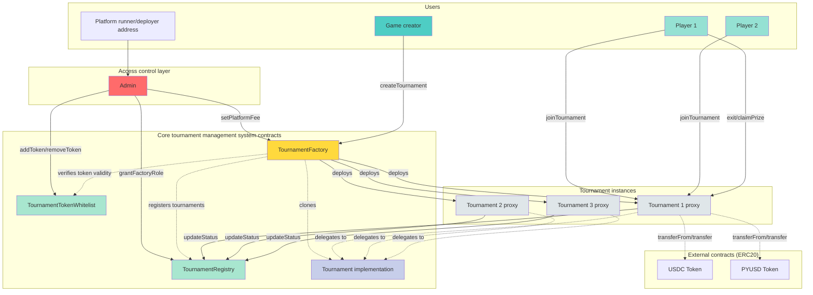

@doing

# Tournament lifecycle

## User stories breakdown

### Tournament design & creation

**As a game designer**

<details>
<summary>
I want to <strong>define immutable, verifiable tournament rules</strong> including:
</summary>
- Players
  - Minimum amount of players (>= 2)
  - Maximum amount of players (optional, 0 = unlimited)
- Start time (UNIX timestamp) (must be > current timestamp)
- Duration in seconds (must be >= 20 minutes aka 1200 seconds)
- Stablecoin to stake (from whitelist: PYUSD, USDC, GHO)

- Stake
  - Minimum stake (optional, default to 0)
  - Maximum stake (optional, must be >= minStake if set)

- Start conditions (ALL enabled must be met):
  - Player count threshold (optional)
  - Pool amount threshold (optional)
  - Timestamp (required) (must be > current timestamp)

At least ONE condition must be enabled.

- Decay
  - Amount: number of coins lost per interval (absolute value) (eg 6 = players will lose 6 coins every interval)
  - Rate: Time between decay applications (in seconds) ; (eg: 1200 = decay applies every 1200 seconds aka 20 minutes) (minimum: 60sec)

Example: `decayAmount: 10`, `gameInterval: 1200` = Players lose 10 coins every 20 minutes

> The game interval used in decay and exit costs calculation is the same.

- Player initial resources:
  - Lives amount (eg 5)
  - Cards per type (eg 10 rock, 10 paper, 10 scissors)
  - Coin conversion rate (eg 1 PYUSD = 100 coins)

- Exit conditions:
- Minimum lives required (eg 3)
- Exit cost formula parameters (pay attention, there's a lot...):
  - 1. Base cost % in BPS
    - Validation: Must be > 0 and <= 10000 BPS (100%)
    - Note: 100 BPS = 1%, so 5000 BPS = 50%
    - This is the initial exit cost as % of player's initial coins (in BPS)
    - Example: `5000` BPS = 50% of initial coins

  - 2. Interval between cost increases (in seconds) (must be > 60)
    - Example: `3600` = cost grows every hour

  - 3. Growth rate per interval (in BPS)
    - Example: `1000` BPS = 10% growth per interval
    - Formula: `cost = baseCost * (1 + rate * intervals)`

_This might be a bit of a mind bender, so here's a quick example of how the exit cost formula parameters work together:_

For 400 initial coins with `base: 5000 BPS`, `rate: 1000 BPS`, `gameInterval: 3600s`:

- Hour 0: 200 coins (50%)
- Hour 1: 220 coins (+10%)
- Hour 2: 240 coins (+10%)

- Creator fee: 0-5% (configurable per tournament)
- Platform fee: 0.5-5% (platform level aka set globally, locked at tournament creation)

**Sum of fees can't be > 10%.**

- Forfeit settings:
  - Allowed (bool)
  - Penalty type (fixed or time based)
  - Max penalty % (0-100)
  - Min penalty % (0-100)

Fixed penalty example: `minPenalty: 20%` = Always lose 20% of stake when forfeiting

Time based penalty example: `minPenalty: 10%`, `maxPenalty: 80%`, 1-hour duration

- Forfeit at start (60min remaining): 80% penalty
- Forfeit at 30min remaining: 40% penalty
- Forfeit at end (0min remaining): 10% penalty
- Formula: `penalty = maxPenalty * (timeRemaining / duration)`, clamped to [min, max]

- (nice to have) Mystery deck card availability (what cards can be in the deck)
- (nice to have) Decay variance law
</details>

So that :

- players can decide **whether or not to join a tournament based on its rules**
- **users can create their own tournaments**

```
GIVEN I am creating a tournament
WHEN I provide parameters
THEN `minPlayers` must be >= 2
  AND `maxPlayers` must be 0 OR >= `minPlayers`
  AND `duration` must be >= 1200 seconds
  AND `startTimestamp> must be > current time
  AND `stakeToken` must be in the whitelist
  AND if `maxStake` > 0, then `maxStake` >= `minStake`
  AND at least ONE start condition must be enabled
  AND `decayBaseRate` must be > 0
  AND `creatorFeePercent` must be <= 5
  AND `creatorFeePercent` + current platform fee <= 10
  AND `initialLives` must be > 0
  AND `cardsPerType` must be > 0
  AND `coinConversionRate` must be > 0
  AND `exitLivesRequired` must be > 0 AND <= `initialLives`

GIVEN I am a user with sufficient funds
WHEN I call `TournamentFactory.createTournament()` with valid params
THEN a new minimal proxy `Tournament` contract is deployed
  AND the tournament is registered in `TournamentRegistry`
  AND creator is set as tournament owner
  AND current platform fee is locked for this tournament
  AND all parameters are stored immutably
  AND `TournamentCreated` event is emitted with tournament address
```

### Discovery

**As a player**,
I want to **browse available tournaments and view their rules**,
So that I can **choose which tournament to join** based on my preferences.

**As a player**,
I want to **see the rules and details of a specific tournament**,
So that I can **choose whether or not to join it** based on my preferences.

#### Tournament fields that are essential for discovery

- Tournament address (to interact with it)
- Creator address (trust/reputation/fun ruleset)
- Stake token (to easily filter out by what I have/don't have)
- Start timestamp (easier to know when it begins)
- Duration (how long is the game?)
- Min/max players (can I join? how competitive?)
- Min/max stake (can I afford it?)
- Start conditions (what neededs to happen for it to start?)
- Status (to know what I can/can't join)

#### Nice but not essential for discovery

- Initial lives
- Cards per type
- Exit lives required
- Decay parameters (details)
- Exit cost formula details

#### Fields that should be on-demand

- Forfeit penalty specifics
- Creator fee
- Platform fee

### Entry

**As a player**,
I want to **join a tournament by staking the required stablecoin amount**,
So that I can **participate in the game**.

```
GIVEN a tournament is in "Open" status
  AND I have approved sufficient `stakeToken` to the tournament contract
WHEN I call `Tournament.joinTournament(stakeAmount)`
THEN `stakeAmount` must be within [minStake, maxStake] bounds
  AND if `maxPlayers` > 0, current player count must be < `maxPlayers`
  AND `stakeToken` is transferred from me to tournament contract
  AND I am added to players mapping
  AND I receive my resources
  AND `PlayerJoined(player, stakeAmount)` event is emitted
  AND IF all start conditions are now met
    THEN tournament auto-starts
    AND `TournamentStarted(startTime, endTime)` event is emitted
```

### Player validation

**As a game system**,
I want to **prevent duplicate tournament joins**,
So that **player counts and stakes are accurate**.

```
GIVEN I am attempting to join a tournament
  AND I have already joined this tournament
WHEN I call `Tournament.joinTournament(stakeAmount)`
THEN transaction reverts with "Player already joined"
```

**As a game system**,
I want to **ensure only registered players can perform actions**,
So that **the game state remains consistent**.

```
GIVEN I am attempting to perform a player action (exit, forfeit, claim)
  AND I have NOT joined this tournament
WHEN I call any player action function
THEN transaction reverts with "Player not found"
```

### Exit (standard)

#### Exit window

**As the game system**,
I want to **only allow exits during the final game interval**,
So that **players must stay engaged throughout the tournament**.

```
GIVEN a tournament is active
  AND exitWindowStart = endTime - gameInterval
WHEN a player attempts to exit
  AND block.timestamp < exitWindowStart
THEN the transaction reverts with "Exit window not open yet"
  AND the player must wait until the exit window opens
```

**As a player**,
I want to **know when the exit window opens**,
So that **I can prepare my resources accordingly**.

```
GIVEN a tournament is active
WHEN I query the exit window start time
THEN the contract returns exitWindowStart timestamp
  AND I can calculate: exitWindowStart = endTime - gameInterval
  AND I can view this in the UI as countdown
```

**As the game system**,
I want to **ensure the game lasts long enough to give the players a chance to exit**,
So that **the game is (relatively) fair**.

```
GIVEN I am attempting to create a tournament
WHEN I input the game interval and game duration value
THEN the I check if the interval can fit at least 3 times in the game duration
```

### Exit (forfeit)

**As a player**,  
I want to **forfeit the tournament and recover part of my stake**,  
So that **I can cut my losses if I know I can't win**.

```
GIVEN a tournament is in "Active" status
  AND I am an active player
  AND `forfeitAllowed` == true
  AND I have NOT already exited or forfeited
WHEN I call `Tournament.forfeit()`
THEN penalty is calculated based on `forfeitPenaltyType`:
  - TimeBased: penalty = maxPenalty × (timeRemaining / duration)
                but constrained by [minPenalty, maxPenalty]
  - Fixed: penalty = minPenalty
THEN penaltyAmount = stakeAmount × penalty / 100
  AND penaltyAmount is added to prize pool
  AND refundAmount = stakeAmount - penaltyAmount
  AND I am marked as `hasForfeited = true`
  AND I can claim `refundAmount` immediately
  AND `PlayerForfeited(player, penaltyAmount, refundAmount)` event is emitted
```

```
GIVEN forfeit is NOT allowed (`forfeitAllowed` == false)
WHEN I call `Tournament.forfeit()`
THEN transaction reverts with "Forfeit not allowed"
```

### Tournament lifecycle automation

#### Starting tournament

**As a game system**,
I want to **automatically start a tournament when conditions are met**,
So that the **game can begin at the appropriate moment with optimal playing conditions**.

```

GIVEN a tournament is in "Open" status
  AND block.timestamp >= `startTimestamp`
WHEN checking start conditions:
  - IF `startPlayerCount` > 0: require playerCount >= `startPlayerCount`
  - IF `startPoolAmount` > 0: require totalStaked >= `startPoolAmount`
  - ALL enabled conditions must be met
THEN tournament status changes directly to "Active"
  AND `actualStartTime` is recorded (block.timestamp)
  AND `endTime` = `actualStartTime` + `duration`
  AND `TournamentStarted(actualStartTime, endTime)` event is emitted
```

#### Locking new participants entry

**As a game system**,
I want to **lock any new entries until the defined when max participants threshold is reached**,
So that **the conditions are respected and the tournament can start as designed**

```
GIVEN a tournament is in "Open" status
  AND playerCount >= maxPlayers
WHEN `updateStatus()` is called (or any auto-updating function)
THEN tournament status changes to "Locked"
  AND no new players can join
  AND `TournamentLocked` event is emitted
```

**As a game system**,
I want to **unlock and allow new participants after a player withdraw before tournament started**,
So that **new participants can join**.

```
GIVEN a tournament is in "Locked" status
  AND playerCount >= maxPlayers
  AND current timestamp < startTimestamp
WHEN `claimRefund()` is called by an existing player
THEN player is marked as not existing
  AND player is refunded their entire stake
  AND player stake is deduced from totalStaked
  AND player state is updated to "Refunded"
  AND tourunament status is changed to "Open"
  AND new players can join
  AND `TournamentUnlocked` event is emitted
```

#### Locking decision

**As a game system**,
I want to **lock the tournament status until the defined start timestamp before making start/cancel decision**,
So that **no race conditions occur during the transition**.

```
GIVEN a tournament is in "Open" status
  AND block.timestamp >= `startTimestamp`
WHEN `updateStatus()` is called (or any auto-updating function)
THEN tournament status changes to "PendingStart"
  AND no new players can join
  AND `TournamentPendingStart(timestamp)` event is emitted
  AND immediately:
    - IF all start conditions are met -> status changes to "Active"
    - ELSE -> status changes to "Cancelled"
```

#### Ending tournament

**As a game system**,
I want to **automatically end a tournament when conditions are met**,
So that **the game can end when planned**.

```
GIVEN a tournament is in "Active" status
WHEN block.timestamp >= `endTime`
  OR all players have exited/forfeited
THEN tournament status changes to "Ended"
  AND winners are identified (players with `hasExited = true`)
  AND prize pool is finalized
  AND `TournamentEnded(winnerCount, prizePool)` event is emitted
```

#### Cancellation

**As a game system**,
I want to **automatically cancel tournament when conditions aren't met**,
So that **the players can get their stake back and avoid the platform runner to be sued**.

```
GIVEN a tournament is in "Open" status
  AND block.timestamp > `startTimestamp`
  AND NOT all start conditions are met
WHEN anyone calls `Tournament.cancel()`
THEN tournament status changes to "Cancelled"
  AND all players can claim their stakes back (full refund)
  AND `TournamentCancelled()` event is emitted
```

### Prize distribution

#### Platform

**As the platform admin**
I want to **collect accumulated platform fees**,
So that **the platform is sustainable** (and I can be ramen profitable).

```
GIVEN platform fees have accumulated across tournaments
WHEN platform admin calls `TournamentFactory.collectPlatformFees(token)`
THEN all fees for that token are transferred to platform treasury
  AND `PlatformFeesCollected(token, amount)` event is emitted
```

**As a platform admin**
I want to **update the global platform fee**,
So I can **rebalance earnings** and **ensure only newly created tournaments use the new fee rate**.

```
GIVEN I am the platform admin
WHEN I call `TournamentFactory.setPlatformFee(newFee)`
THEN `newFee` must be <= 5% (500 basis points)
  AND `newFee` is stored as the new default
  AND existing tournaments are NOT affected
  AND `PlatformFeeUpdated` event is emitted
```

#### Creator

**As the tournament creator**
I want to **collect game design fees**,
So that I can **get some compensation for my creation**.

```
GIVEN a tournament has ended
  AND creator fees were configured (creatorFeePercent > 0)
  AND I am the tournament creator
  AND I have NOT yet collected creator fees
WHEN I call `Tournament.collectCreatorFees()`
THEN creatorFeeAmount is calculated from prize pool
  AND `stakeToken.transfer(creator, creatorFeeAmount)` succeeds
  AND creator is marked as `hasCollectedFees = true`
  AND `CreatorFeesCollected(creator, amount)` event is emitted
```

```
GIVEN I am NOT the creator OR already collected
WHEN I call `Tournament.collectCreatorFees()`
THEN transaction reverts with "Only creator" or "Already collected"
```

#### Player

**As a winner**,
I want to **manually claim my prize after the tournament ends**,
So that **I receive my share of the prize pool**.

```
GIVEN a tournament is in "Ended" status
  AND there are W winners (W >= 1)
WHEN calculating prize distribution:
  THEN totalPrizePool = totalStaked + totalForfeitPenalties
    AND platformFeeAmount = totalPrizePool × platformFeePercent / 100
    AND creatorFeeAmount = totalPrizePool × creatorFeePercent / 100
    AND distributionPool = totalPrizePool - platformFeeAmount - creatorFeeAmount
    AND prizePerWinner = distributionPool / W

GIVEN I am a winner
  AND I have NOT yet claimed
WHEN I call `Tournament.claimPrize()`
THEN `stakeToken.transfer(msg.sender, prizePerWinner)` succeeds
  AND I am marked as `hasClaimed = true`
  AND `PrizeClaimed(player, amount)` event is emitted
```

```
GIVEN I am NOT a winner OR already claimed
WHEN I call `Tournament.claimPrize()`
THEN transaction reverts with appropriate error
```

---

(future)
**As a game designer**,
I want to **end the tournament when duration expires or all conditions are met**,
So that **winners can be determined and prizes distributed without requiring manual interaction**.

```
GIVEN a tournament is in "Completed" status
WHEN `claimPrize()` is called
THEN fees are calculated and deducted (eg: 1% platform fee, 0.25% creator fee)
  AND remaining pool is split among winners
  AND `stakeToken` is transferred to each winner
  AND `PrizesDistributed` event is emitted
```

### Refund

**As a player in a non-started tournament**
I want to **claim my full stake** back,
So that **my funds aren't locked**.

**As a player in a cancelled tournament**
I want to **claim my full stake** back,
So that **my funds aren't locked**.

```
GIVEN a tournament is in "Cancelled" OR "Open" OR "PendingStart" status
  AND I joined the tournament
  AND I have NOT yet claimed refund
WHEN I call `Tournament.claimRefund()`
THEN `stakeToken.transfer(msg.sender, myStakeAmount)` succeeds
  AND I am marked as `hasClaimedRefund = true`
  AND `RefundClaimed(player, amount)` event is emitted
```

## Technical breakdown

Tournament management is built on a permissionless system where game designers can create Bad Debt Tycoon games with customizable rules.

The platform maintains **two gatekeepers**: administrators define and manage which stablecoins can be used as entry fees, and authorize which entities can create valid tournaments. All tournaments are tracked in a central registry that monitors their current state.

Each tournament operates as an **isolated game** with fixed rules set at creation—player limits, entry amounts, duration, starting resources, and win conditions. Players enter by depositing an approved stablecoin.

Tournaments automatically progress through their lifecycle:

**Tournament auto starts flow** (success)

- Open -> Locked (if maxPlayers is defined and reached) -> PendingStart -> Active -> Ended

If a player withdraws before the tournament starts, "Locked" status reverts back to "Open" automatically. A player can re-enter as long as the tournament is open, but they will need to restake.

**Tournament auto cancellation flow**

- Open -> PendingStart -> Cancelled (conditions not met)

**Rare flow: tournament ends early**
If all players either successfully exited or forfeited before the end of the tournament (meaning there are no Active players left), the tournament automatically ends (Active -> Ended).

Besides status automation, financial operations automation is also enforces by the system: collecting entry fees, reinbursments tracking (in case of cancellation), withdrawal trakcing, calculating prizes and tracking exit eligibility.

When a tournament concludes, winners withdraw their prize share, the game designer (tournament creator) can claim their fee (if they included that parameter), and the platform can collect its fee.

### System requirements

#### `TournamentTokenWhitelist.sol`

- **Goal**: Maintains approved stablecoin addresses for tournament stakes
- **Who uses it**: Platform admin (deployer/owner)
- **How it's used**: Admin adds/removes ERC20 token addresses from whitelist
- **Events**: `TokenWhitelisted`, `TokenRemovedFromWhitelist`

#### `TournamentRegistry.sol`

- **Goal**: Central registry that:
  - Grants/revokes right to contracts to be a sanctioned Tournament factory (= a contract that can create Tournament contracts)
  - Tracks all tournaments contracts and their statuses
- **Who uses it**:
  - Platform admin (grants/revokes factory role)
  - Authorized factories (register new tournaments)
  - Tournament contracts (update their own status)
  - Anyone (query tournaments by status)
- **How it's used**:
  - Admin whitelists authorized factory contracts
  - Only whitelisted factories can register tournaments when created (initial status: `Open`)
  - Tournaments update their own status as game progresses
  - Anyone can query tournaments by status
- **Events**: `FactoryRoleGranted`, `FactoryRoleRevoked`, `TournamentRegistered`, `TournamentStatusUpdated`
- **Statuses**: `Open` ; `PendingStart` ; `Active` ; `Ended` ; `Cancelled` ; `

#### `TournamentFactory.sol`

- **Goal**: Deploys tournament instances and manages platform-wide settings
- **Who uses it**:
  - Platform admin (updates platform fee, collects fees)
  - Game creators (create tournaments with custom parameters)
- **How it's used**:
  - Game designer creates tournament with ruleset parameters
  - Factory validates parameters against whitelist and rules
  - Deploys minimal proxy pointing to `Tournament` implementation
  - Registers new tournament in `TournamentRegistry`
  - Locks current platform fee for that tournament
- **Events**: `TournamentCreated`, `PlatformFeeUpdated`, `PlatformFeesCollected`

#### `Tournament.sol`

- **Who uses it**:
  - Players (join, exit, forfeit, claim prizes)
  - Tournament creator (collect creator fees)
  - System (automatic status transitions and asset distribution)
- **How it's used**:
  - Players join by staking whitelisted tokens
  - Tournament starts when ALL enabled start conditions are met
  - Players can withdraw from the competition and get their full stake back BEFORE the tournament starts
  - Players can forfeit during the competition (which involves their stake getting potentially slashed, depending on the parameters of the tournament)
  - In case a tournament is cancelled, players can claim back their stake
  - Players manage their economic state (lives, coins, cards, debt)
  - Winners exit when meeting all exit conditions
  - After tournament ends, winners claim their prizes, creator and platform get their fees
- **State**: Immutable parameters (set at creation) + mutable state (players, resources, status)
- **Events**: `PlayerJoined`, `TournamentStarted`, `PlayerExited`, `PlayerForfeited`, `TournamentEnded`, `TournamentCancelled`, `PrizeClaimed`, `CreatorFeesCollected`


