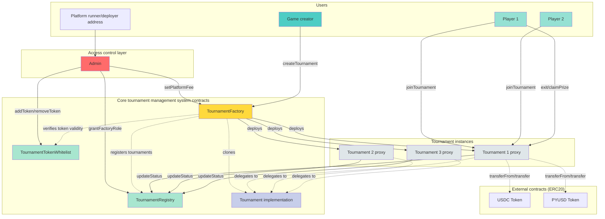

@doing

# Tournament lifecycle

## User stories breakdown

### Tournament design & creation

**As a game designer**

I want to **define immutable, verifiable tournament rules** including:

- Players
  - Minimum amount of players (>= 2)
  - Maximum amount of players (optional, 0 = unlimited)
- Start time (timestamp)
- Duration (>= 20 minutes / 1200 seconds)
- Stablecoin to stake (from whitelist: PYUSD, USDC, GHO)
- Stake

  - Minimum stake (optional)
  - Maximum stake (optional, must be >= minStake if set)

- Start conditions (ALL enabled must be met):
  - Player count threshold (optional)
  - Pool amount threshold (optional)
  - Timestamp (required)

At least ONE condition must be enabled.

- Decay base rate (coins lost per hour)
- Player initial resources:

  - Lives amount (eg 5)
  - Cards per type (eg 10 rock, 10 paper, 10 scissors)
  - Coin conversion rate (eg 1 PYUSD = 100 coins)

- Exit conditions:

  - Minimum lives required (eg 3)
  - Exit cost formula parameters

- Fees:

  - Creator fee: 0-5% (configurable per tournament)
  - Platform fee: 0.5-5% (platform level aka set globally, locked at tournament creation)

- Forfeit settings:

  - Allowed (bool)
  - Penalty type (Fixed, TimeBased)
  - Max penalty % (0-100)
  - Min penalty % (0-100)

- (nice to have) Mystery deck card availability
- (nice to have) Decay variance law

So that...

- players can decide **whether or not to join a tournament based on its rules**
- **users can create their own tournaments**

```
GIVEN I am creating a tournament
WHEN I provide parameters
THEN `minPlayers` must be >= 2
  AND `maxPlayers` must be 0 OR >= `minPlayers`
  AND `duration` must be >= 1200 seconds
  AND `stakeToken` must be in the whitelist
  AND if `maxStake` > 0, then `maxStake` >= `minStake`
  AND at least ONE start condition must be enabled
  AND `decayBaseRate` must be > 0
  AND `creatorFeePercent` must be <= 5
  AND `creatorFeePercent` + current platform fee <= 10
  AND `initialLives` must be > 0
  AND `cardsPerType` must be > 0
  AND `coinConversionRate` must be > 0
  AND `exitLivesRequired` must be > 0 AND <= `initialLives`

GIVEN I am a user with sufficient funds
WHEN I call `TournamentFactory.createTournament()` with valid params
THEN a new minimal proxy `Tournament` contract is deployed
  AND the tournament is registered in `TournamentRegistry`
  AND creator is set as tournament owner
  AND current platform fee is locked for this tournament
  AND all parameters are stored immutably
  AND `TournamentCreated` event is emitted with tournament address
```

**As a platform admin**
I want to **update the global platform fee**,
So I can **rebalance earnings** and **ensure only newly created tournaments use the new fee rate**.

```
GIVEN I am the platform admin
WHEN I call `TournamentFactory.setPlatformFee(newFee)`
THEN `newFee` must be <= 5% (500 basis points)
  AND `newFee` is stored as the new default
  AND existing tournaments are NOT affected
  AND `PlatformFeeUpdated` event is emitted
```

**As a tournament creator**,  
I want to **configure forfeit penalties**,  
So that **I can discourage griefing while allowing graceful exits**.

```
GIVEN a tournament creator is setting parameters
WHEN defining forfeit rules
THEN they can choose:

forfeitAllowed (bool): Enable/disable forfeit
forfeitPenaltyType (enum): Fixed, TimeBased, Custom
forfeitMaxPenalty (uint8): Maximum penalty % (0-100)
forfeitMinPenalty (uint8): Minimum penalty % (0-100)
```

### Discovery

**As a player**,
I want to **browse available tournaments and view their rules**,
So that I can **choose which tournament to join** based on my preferences.

### Entry

**As a player**,
I want to **join a tournament by staking the required stablecoin amount**,
So that I can **participate in the game**.

```
GIVEN a tournament is in "Open" status
  AND I have approved sufficient `stakeToken` to the tournament contract
WHEN I call `Tournament.joinTournament(stakeAmount)`
THEN `stakeAmount` must be within [minStake, maxStake] bounds
  AND if `maxPlayers` > 0, current player count must be < `maxPlayers`
  AND `stakeToken` is transferred from me to tournament contract
  AND I am added to players mapping
  AND my initial resources are recorded:
    - lives = `initialLives`
    - coins = `stakeAmount` * `coinConversionRate`
    - cards = `cardsPerType` for each type (rock, paper, scissors)
  AND `PlayerJoined(player, stakeAmount)` event is emitted
  AND IF all start conditions are now met
    THEN tournament auto-starts
    AND `TournamentStarted(startTime, endTime)` event is emitted
```

### Exit (standard)

**As a player**
I want to **exit the tournament when I meet all requirements**,
So that I can **secure my position as a winner**.

```
GIVEN a tournament is in "Active" status
  AND I am an active player
WHEN I call `Tournament.exit()`
THEN the following conditions must ALL be met:
  - lives >= `exitLivesRequired`
  - cards[ROCK] == 0 AND cards[PAPER] == 0 AND cards[SCISSORS] == 0
  - coins >= calculateExitCost() (compounds based on time elapsed)
  - debt == 0
THEN I am marked as `hasExited = true`
  AND I am added to winners list
  AND `PlayerExited(player, exitTime)` event is emitted
  AND IF all players have exited/forfeited
    THEN tournament ends early
```

### Exit (forfeit)

**As a player**,  
I want to **forfeit the tournament and recover part of my stake**,  
So that **I can cut my losses if I know I can't win**.

```
GIVEN a tournament is in "Active" status
  AND I am an active player
  AND `forfeitAllowed` == true
  AND I have NOT already exited or forfeited
WHEN I call `Tournament.forfeit()`
THEN penalty is calculated based on `forfeitPenaltyType`:
  - TimeBased: penalty = maxPenalty × (timeRemaining / duration)
                but constrained by [minPenalty, maxPenalty]
  - Fixed: penalty = minPenalty
THEN penaltyAmount = stakeAmount × penalty / 100
  AND penaltyAmount is added to prize pool
  AND refundAmount = stakeAmount - penaltyAmount
  AND I am marked as `hasForfeited = true`
  AND I can claim `refundAmount` immediately
  AND `PlayerForfeited(player, penaltyAmount, refundAmount)` event is emitted
```

```
GIVEN forfeit is NOT allowed (`forfeitAllowed` == false)
WHEN I call `Tournament.forfeit()`
THEN transaction reverts with "Forfeit not allowed"
```

### Tournament lifecycle automation

**As a game system**,
I want to **automatically start a tournament when conditions are met**,
So that the **game can begin at the appropriate moment with optimal playing conditions**.

#### Starting tournament

```
GIVEN a tournament is in "Open" status
  AND block.timestamp >= `startTimestamp`
WHEN checking start conditions:
  - IF `startPlayerCount` > 0: require playerCount >= `startPlayerCount`
  - IF `startPoolAmount` > 0: require totalStaked >= `startPoolAmount`
  - Timestamp condition is always checked (must be >= `startTimestamp`)
  - ALL enabled conditions must be met
THEN tournament status changes to "Active"
  AND `actualStartTime` is recorded (block.timestamp)
  AND `endTime` = `actualStartTime` + `duration`
  AND @todo: secret objectives are assigned (future)
  AND `TournamentStarted(actualStartTime, endTime)` event is emitted
```

#### Ending tournament

**As a game system**,
I want to **automatically end a tournament when conditions are met**,
So that **the game can end when planned**.

```
GIVEN a tournament is in "Active" status
WHEN block.timestamp >= `endTime`
  OR all players have exited/forfeited
THEN tournament status changes to "Ended"
  AND winners are identified (players with `hasExited = true`)
  AND prize pool is finalized
  AND `TournamentEnded(winnerCount, prizePool)` event is emitted
```

#### Cancellation

**As a game system**,
I want to **automatically cancel tournament when conditions aren't met**,
So that **the players can get their stake back and avoid the platform runner to be sued**.

```
GIVEN a tournament is in "Open" status
  AND block.timestamp > `startTimestamp`
  AND NOT all start conditions are met
WHEN anyone calls `Tournament.cancel()`
THEN tournament status changes to "Cancelled"
  AND all players can claim their stakes back (full refund)
  AND `TournamentCancelled()` event is emitted
```

### Prize distribution

#### Platform

**As the platform admin**
I want to **collect accumulated platform fees**,
So that **the platform is sustainable** (and I can be ramen profitable).

```
GIVEN platform fees have accumulated across tournaments
WHEN platform admin calls `TournamentFactory.collectPlatformFees(token)`
THEN all fees for that token are transferred to platform treasury
  AND `PlatformFeesCollected(token, amount)` event is emitted
```

#### Creator

**As the tournament creator**
I want to **collect game design fees**,
So that I can **get some compensation for my creation**.

```
GIVEN a tournament has ended
  AND creator fees were configured (creatorFeePercent > 0)
  AND I am the tournament creator
  AND I have NOT yet collected creator fees
WHEN I call `Tournament.collectCreatorFees()`
THEN creatorFeeAmount is calculated from prize pool
  AND `stakeToken.transfer(creator, creatorFeeAmount)` succeeds
  AND creator is marked as `hasCollectedFees = true`
  AND `CreatorFeesCollected(creator, amount)` event is emitted
```

```
GIVEN I am NOT the creator OR already collected
WHEN I call `Tournament.collectCreatorFees()`
THEN transaction reverts with "Only creator" or "Already collected"
```

#### Player

**As a winner**,
I want to manually claim my prize after the tournament ends,
So that I receive my share of the prize pool.

```
GIVEN a tournament is in "Ended" status
  AND there are W winners (W >= 1)
WHEN calculating prize distribution:
  THEN totalPrizePool = totalStaked + totalForfeitPenalties
    AND platformFeeAmount = totalPrizePool × platformFeePercent / 100
    AND creatorFeeAmount = totalPrizePool × creatorFeePercent / 100
    AND distributionPool = totalPrizePool - platformFeeAmount - creatorFeeAmount
    AND prizePerWinner = distributionPool / W

GIVEN I am a winner
  AND I have NOT yet claimed
WHEN I call `Tournament.claimPrize()`
THEN `stakeToken.transfer(msg.sender, prizePerWinner)` succeeds
  AND I am marked as `hasClaimed = true`
  AND `PrizeClaimed(player, amount)` event is emitted
```

```
GIVEN I am NOT a winner OR already claimed
WHEN I call `Tournament.claimPrize()`
THEN transaction reverts with appropriate error
```

---

(future)
**As a game designer**,
I want to **end the tournament when duration expires or all conditions are met**,
So that **winners can be determined and prizes distributed without requiring manual interaction**.

```
GIVEN a tournament is in "Completed" status
WHEN `claimPrize()` is called
THEN fees are calculated and deducted (eg: 1% platform fee, 0.25% creator fee)
  AND remaining pool is split among winners
  AND `stakeToken` is transferred to each winner
  AND `PrizesDistributed` event is emitted
```

### Reinbursment

**As a player in a cancelled tournament**
I want to **claim my full stake **back,
So that **my funds aren't locked**.

```
GIVEN a tournament is in "Cancelled" status
  AND I joined the tournament
  AND I have NOT yet claimed refund
WHEN I call `Tournament.claimRefund()`
THEN `stakeToken.transfer(msg.sender, myStakeAmount)` succeeds
  AND I am marked as `hasClaimedRefund = true`
  AND `RefundClaimed(player, amount)` event is emitted
```

## Technical breakdown

Tournament management is built on a permissionless system where game designers can create Bad Debt Tycoon games with customizable rules.

The platform maintains **two gatekeepers**: administrators define and manage which stablecoins can be used as entry fees, and authorize which entities can create valid tournaments. All tournaments are tracked in a central registry that monitors their current state.

Each tournament operates as an **isolated game** with fixed rules set at creation—player limits, entry amounts, duration, starting resources, and win conditions. Players enter by depositing an approved stablecoin. Tournaments automatically progress through their lifecycle: `Open` (accepting players) -> `Active` (game in progress) -> `Ended` (complete), or `Open` → `Cancelled` (if start requirements weren't met).

The system enforces all **financial rules**: collecting entry fees, reinbursments tracking (in case of cancellation), calculating prizes and tracking exit eligibilit.

When a tournament concludes, winners withdraw their prize share, the platform collect its fee, and game designers can claim their fee.

### System requirements

#### `TournamentTokenWhitelist.sol`

- **Goal**: Maintains approved stablecoin addresses for tournament stakes
- **Who uses it**: Platform admin (deployer/owner)
- **How it's used**: Admin adds/removes ERC20 token addresses from whitelist
- **Events**: `TokenWhitelisted`, `TokenRemovedFromWhitelist`

#### `TournamentRegistry.sol`

- **Goal**: Central registry that:
  - Grants/revokes right to contracts to be a sanctioned Tournament factory (= a contract that can create Tournament contracts)
  - Tracks all tournaments contracts and their statuses
- **Who uses it**:
  - Platform admin (grants/revokes factory role)
  - Authorized factories (register new tournaments)
  - Tournament contracts (update their own status)
  - Anyone (query tournaments)
- **How it's used**:
  - Admin whitelists authorized factory contracts
  - Only whitelisted factories can register tournaments when created (initial status: `Open`)
  - Tournaments update their own status as game progresses
  - Anyone can query tournaments by status
- **Events**: `FactoryRoleGranted`, `FactoryRoleRevoked`, `TournamentRegistered`, `TournamentStatusUpdated`
- **Statuses**: `Open` ; `Active` ; `Ended` ; `Cancelled`

#### `TournamentFactory.sol`

- **Goal**: Deploys tournament instances and manages platform-wide settings
- **Who uses it**:
  - Platform admin (updates platform fee, collects fees)
  - Game creators (create tournaments with custom parameters)
- **How it's used**:
  - Game designer creates tournament with ruleset parameters
  - Factory validates parameters against whitelist and rules
  - Deploys minimal proxy pointing to `Tournament` implementation
  - Registers new tournament in `TournamentRegistry`
  - Locks current platform fee for that tournament
- **Events**: `TournamentCreated`, `PlatformFeeUpdated`, `PlatformFeesCollected`

#### `Tournament.sol`

- **Who uses it**:
  - Players (join, exit, forfeit, claim prizes)
  - Tournament creator (collect creator fees)
  - System (automatic status transitions)
- **How it's used**:
  - Players join by staking whitelisted tokens
  - Tournament auto-starts when ALL enabled start conditions are met
  - In case tournament is cancelled, players can claim back their funds
  - Players manage their economic state (lives, coins, cards, debt)
  - Winners exit when meeting all exit conditions
  - After tournament ends, winners claim prizes, creator claims fees
- **State**: Immutable parameters (set at creation) + mutable state (players, resources, status)
- **Events**: `PlayerJoined`, `TournamentStarted`, `PlayerExited`, `PlayerForfeited`, `TournamentEnded`, `TournamentCancelled`, `PrizeClaimed`, `CreatorFeesCollected`


